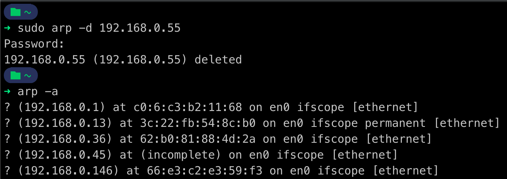
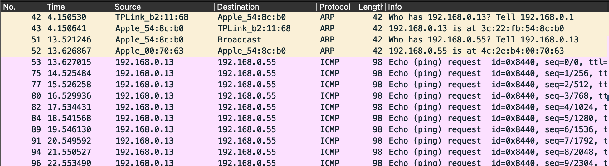
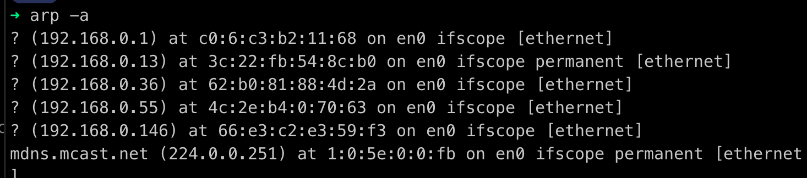

# НАЛАШТУВАННЯ МЕРЕЖНОГО ОТОЧЕННЯ ТА ТЕСТУВАННЯ ПРОТОКОЛУ ARP

* **Test case ID:** 1
* **Description:**
    Test the network environment at the at the data link layer of the OSI model.
* **Pre-Conditions:**
    1. Clear the ARP table with the command:

        ```bash
        sudo arp -d IP-адреса
        ```

    2. Make sure the ARP table is empty:

        ```bash
        arp -a
        ```

    3. Run wireshark.

        ```bash
        sudo wireshark
        ```

* **Test steps:**
    1. Ping your smartphone from your computer via Wi-Fi.
    2. In Wireshark, remove the traffic that we are not interested in and highlight the lines with the ARP protocol using filters.
    3. Use Wireshark to analyze the received traffic.
    4. Check the ARP table with the command:

        ```bash
        arp -a
        ```

* **Expected result:**
    1. Ensure that the MAC address is received at the known IP address.
    2. Ensure that the arp table is updated when an arp-reply is received.

* **Actual result:**
    1. 
    2. 
    3. 
