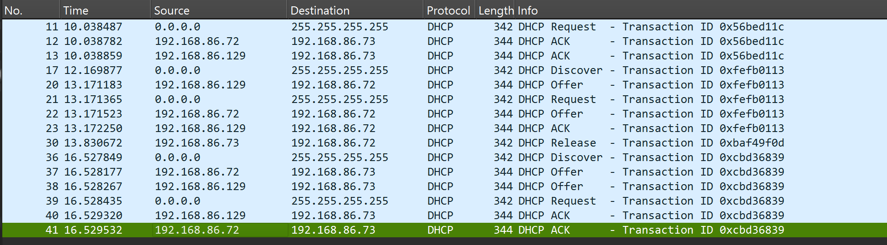

# Ознайомитися з DHCP протоколом. Навчитися налаштовувати DHCP сервер у конфіг файлі /etc/dhcp/dhcpd.conf.

33 % 3 = 0

* **Defect Id**: 1
* **Defect Description**:
    When attempting start DHCP server, error accured.
    1. 
    2. 
* **Steps to reproduce**:
    1. Check you network configuration:
    ```bash
    ifconfig
    ```
    2. Open the config file: 
    ```bash 
       vim /etc/dhcp/dhcpd.conf 
    ```
    3. According to your network config fill dhcpd.conf, but leave options router as in the example:
    ```
    default-lease-time 600;
    max-lease-time 7200;
    option subnet-mask 255.255.255.0;
    option broadcast-address 192.168.86.255;
    option routers 192.168.1.300;
    option domain-name-servers 192.168.1.1, 8.8.8.8;
    option domain-name "mydomain.example";
    subnet 192.168.86.0 netmask 255.255.255.0 {
    range 192.168.86.70 192.168.86.100;
    }
    ```
    4. Start DHCP server:
    ```bash
    sudo systemctl start isc-dhcp-server
    ```
    5. Check DHCP server status:
    ```bash
    sudo systemctl status isc-dhcp-server
    ```
* **Expected Result**:
    1. 
    2. 
    3. 
    4. 

