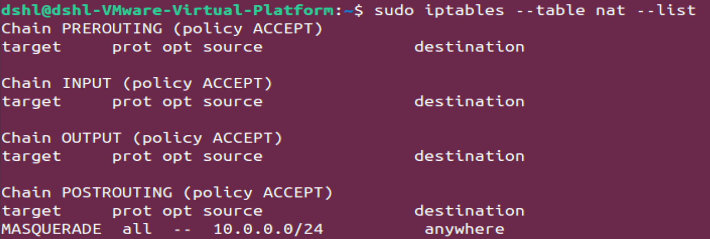
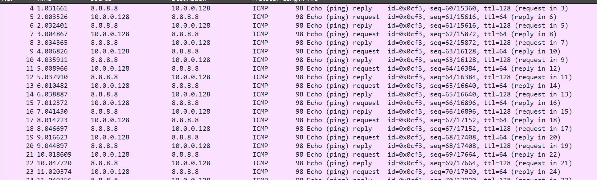
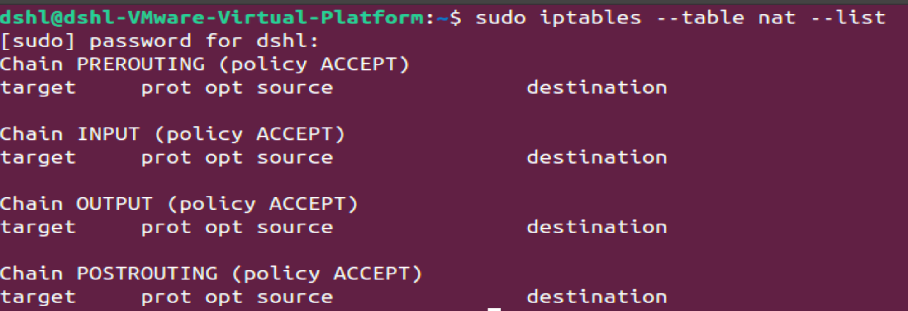

# Служби DNS та NAT. Підходи до траблшутінгу мережі 

## DHCP/NAT Test Plan
* **Objective:**
  1. Verify the correct configuration of NAT for routing between the local and external networks.
  2. Validate the functionality of the DHCP server in assigning IP addresses to clients.
  3. Identify and resolve possible connection issues.
* **Scope of Testing:**
  1. Configuration of NAT using iptables.
  2. DHCP server functionality and IP address allocation to clients.
  3. Connection verification between client and server through NAT.
* **Tools:**
```
iptables, sysctl, Wireshark, ping, route, cat, systemctl, dhclient.
```
* **Key Testing Activities:**
  1. Reviewing and configuring NAT rules.
  2. Testing NAT routing functionality via iptables.
  3. Checking DHCP server settings.
  4. Validating connectivity between clients.
* **Exit Criteria:**
  
    Testing is complete when all critical NAT and DHCP functions work as expected.


## DHCP/NAT TestCase

* **Test case ID:** 1
* **Description:**
  
    Add NAT rules to translate internal network addresses to a public address.
* **Pre-Conditions:**
  1. IP forwarding must be enabled.
  2. iptables must be installed and operational.
* **Test steps:**
  1. Add a NAT rule for masquerading internal addresses using the command:
     ```bash
     sudo iptables -t nat -A POSTROUTING -s 10.0.0.0/24 -j MASQUERADE
     ```
  2. Verify that the rule has been added:
     ```bash
     sudo iptables --table nat --list
     ```
  3. Run Wireshark on PC1. On the second computer, type ping google.com
* **Expected result:**
  1. The new NAT rule is visible in the list of NAT rules.
  2. In Wireshark, outgoing ICMP packets from PC2 are visible, translated to PC1's public IP.
  3. PC2 successfully receives replies from google.com, confirming internet access.

* **Actual result:**
    1. 
    2. 


## DHCP/NAT Defect Report

* **Defect Id**: 1
* **Defect Description**:
    NAT rules do not persist after a system reboot.
    1. 
    2. 
* **Steps to reproduce**:
  1. Add a NAT rule:
      ```bash
      sudo iptables -t nat -A POSTROUTING -s 10.0.0.0/24 -j MASQUERADE
      ```
  2. Verify that the rule was added:
      ```bash
      sudo iptables -t nat -L
      ```
  3. Reboot the system:
      ```bash
      sudo reboot
      ```
  4. Check the NAT rules after the reboot:
      ```bash
      sudo iptables --table nat --list
      ```
* **Expected Result**:
    1. 
