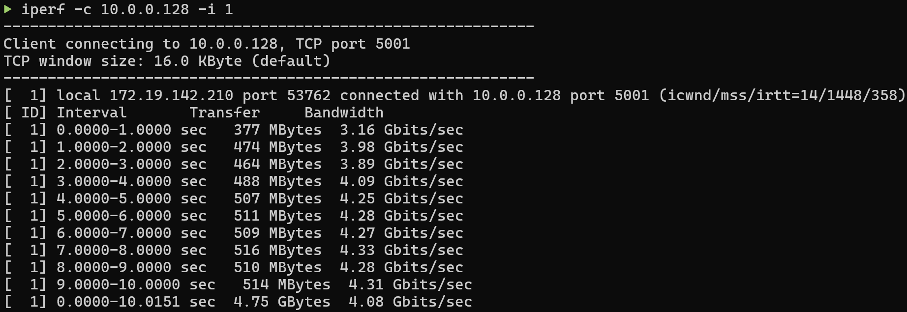
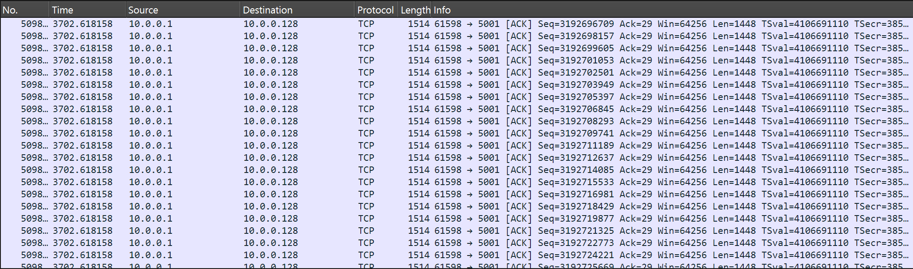
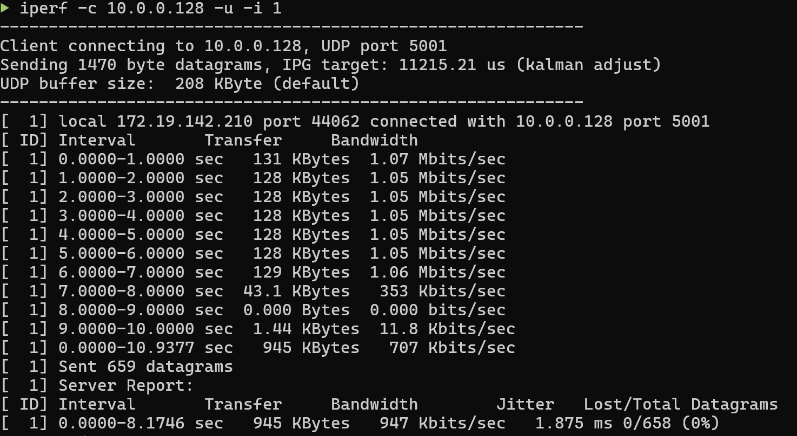
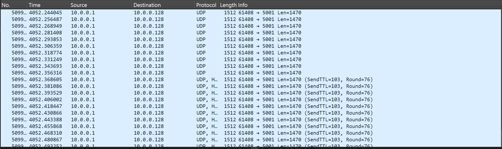
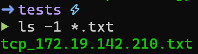
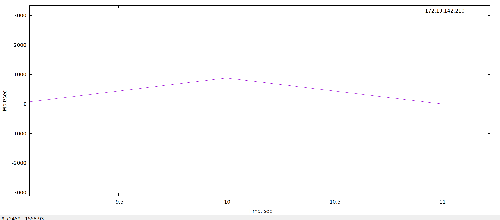
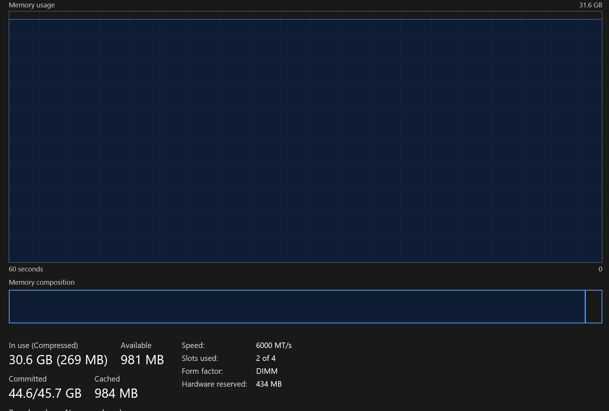
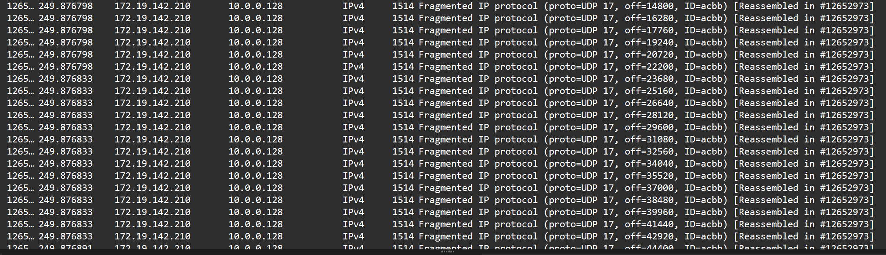
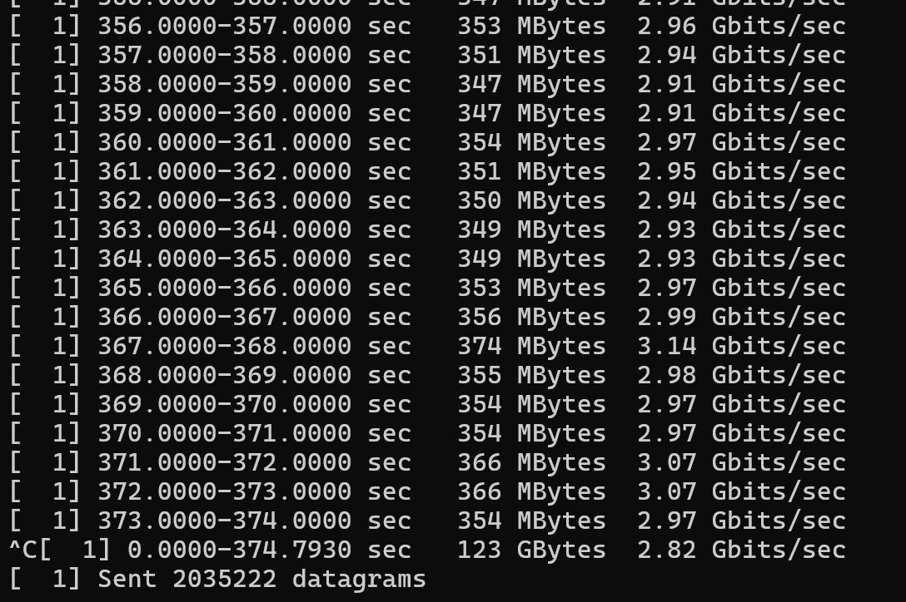

# Тестування навантаження комп'ютерної мірежі.

* **Test case ID:** 1
* **Description:**
    Test the establishment and performance of a TCP connection between a client and a server using iperf.
* **Pre-Conditions:**
    1. Install iperf on both the client and server machines:

        ```bash
        sudo apt install iperf
        ```

    2. Ensure both systems are connected to the same network.
    3. Open Wireshark on both systems to monitor traffic.

* **Test steps:**
    1. Start the iperf server on the server machine:
        ```bash
        iperf -s
        ```
    2. On the client machine, initiate a TCP connection to the server:
        ```bash
        iperf -c <server_IP>
        ```
    3. Use the interval option for detailed output
        ```bash
        iperf -c <server_IP> -i 1
        ```
    4. Analyze the TCP traffic in Wireshark on both systems.
* **Expected result:**
    1. A three-way TCP handshake (SYN, SYN-ACK, ACK) is visible in Wireshark.
    2. The client and server exchange data, with throughput displayed in the iperf output.

* **Actual result:**
    1. 
    2. 


* **Test case ID:** 2
* **Description:**
    Test the establishment and performance of a UDP connection between a client and a server using iperf.
* **Pre-Conditions:**
    1. Install iperf on both the client and server machines:

        ```bash
        sudo apt install iperf
        ```

    2. Ensure both systems are connected to the same network.
    3. Open Wireshark on both systems to monitor traffic.

* **Test steps:**
    1. Start the iperf server on the server machine:
        ```bash
        iperf -s -u
        ```
    2. On the client machine, initiate a TCP connection to the server:
        ```bash
        iperf -c <server_IP> -u
        ```
    3. Use the interval option for detailed output
        ```bash
        iperf -c <server_IP> -u -i 1
        ```
    4. Analyze the UDP traffic in Wireshark on both systems.
* **Expected result:**
    1. UDP packets are sent from the client to the server without establishing a connection.
    2. The client and server exchange data, with throughput displayed in the iperf output.

* **Actual result:**
    1. 
    2. 


* **Test case ID:** 3
* **Description:**
    Conduct a stress test on the network using a TCP traffic generation script to measure performance over an extended period.
* **Pre-Conditions:**
    1. Install iperf on both the client and server machines:

        ```bash
        sudo apt install iperf
        ```

    2. Ensure both systems are connected to the same network.
    3. Open Wireshark on both systems to monitor traffic.
    4. Create a bash script for TCP traffic testing:
        ```bash
            #!/bin/bash
            print_usage() {
            echo "Usage: $0 ip_addr device"
            }
            if [ $# -ne 2 ]; then
            echo "Error: Too few arguments" >&2
            print_usage
            exit 1
            fi
            iperf -c $1 -i 1 -t 30 | tee tcp_$2.txt
        ```
    5. Save the script as bashTCP and make it executable:
        ```bash
        chmod +x ./bashTCP
        ```
    6. Create gnuplot script for the graph of TCP throughput:
        ```bash
            #!/usr/bin/gnuplot -persist

            set xlabel "Time, sec"
            set ylabel "Mbit/sec"

            files = system("ls -1 *.txt")
            phone(f) = substr(f, 5, strlen(f) - 4)

            plot \
            for [file in files] file \
            using ($3>8 ? $7 : $8) \
            every ::6 \
            title phone(file) \
            with lines

            pause mouse close
        ```
     7. Save the script as plotTCP.gpi and make it executable:
        ```bash
        chmod +x plotTCP.gpi
        ```
* **Test steps:**
    1. Run the script on the client machine:
        ```bash
        ./bashTCP <server_IP> <client_name>
        ```
    2. After completion, generate a graph using the following gnuplot script:
        ```bash
        ./plotTCP.gpi
        ```
* **Expected result:**
    1. A .txt file is generated containing TCP throughput data.
    2. A graph of TCP throughput over time is displayed.

* **Actual result:**
    1. 
    2. 


* **Test case ID:** 4
* **Description:**
    Test network performance under load by sending UDP traffic with large packets.
* **Pre-Conditions:**
    1. Install iperf on both the client and server machines:

        ```bash
        sudo apt install iperf
        ```

    2. Ensure both systems are connected to the same network.
    3. Open Wireshark on both systems to monitor traffic.
* **Test steps:**
    1. Start the iperf server on the server machine:
        ```bash
        iperf -s -u
        ```
    2. On the client machine, initiate a TCP connection to the server:
        ```bash
        iperf -c <server_IP> -i 1 -t 500 -b 70G -l 65000 -u
        ```
    3. Analyze the UDP traffic in Wireshark on both systems.
* **Expected result:**
    1. The server receives large UDP packets without failure.
    2. Throughput statistics are displayed in iperf.
    3. High RAM usage.

* **Actual result:**
    1. 
    2. 
    3. 