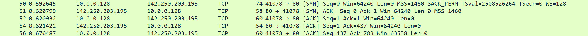
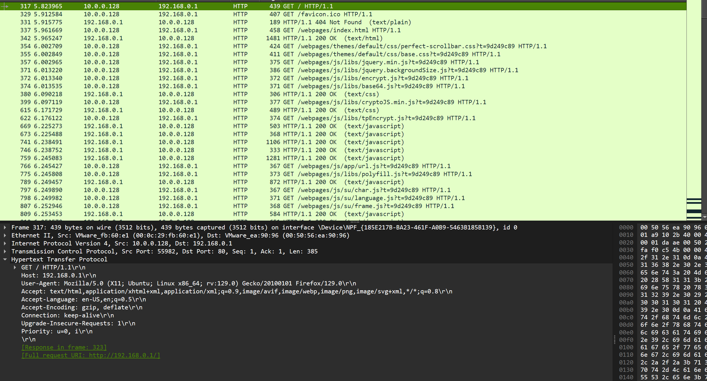

 **Test case ID:** 1
* **Description:**
    Verify the functionality of the protocol stack layers according to the OSI model for an HTTP session between two systems (PC1 as the NAT/DHCP server and PC2 as the client).
* **Pre-Conditions:**
    1. PC1 and PC2 are connected via Ethernet.
    2. DHCP server is installed and configured on PC1.
    3. NAT is configured on PC1.
    4. Wireshark is installed on PC1 and PC2 for packet capture.
    5. An HTTP service is accessible on PC1 or a router's IP.
* **Test steps:**
    1. Setup DHCP Connection::
        ```bash
        sudo dhcpd
        sudo dhclient <interface_name>
        ```
    2. Verify that PC2 has received an IP address and the default gateway points to PC1::
        ```bash
        route -n
        ```
    3. Open an Internet browser on the PC-2 and enter the IP address of the of the router
    4. 
* **Expected result:**
    1. Layer 2 (ARP): Successful resolution of PC2's MAC address.
    2. Layer 4 (TCP): Visible TCP handshake and stable connection for the HTTP session.
    3. Layer 5 (Session): Persistent TCP session during HTTP activity.
    4. Layer 6 (Presentation): Encoded/decoded data visible in the HTTP headers.
    5. Layer 7 (Application): Correct HTTP requests and responses, indicating successful interaction.

* **Actual result:**
    1. 
    2. 
    3. 