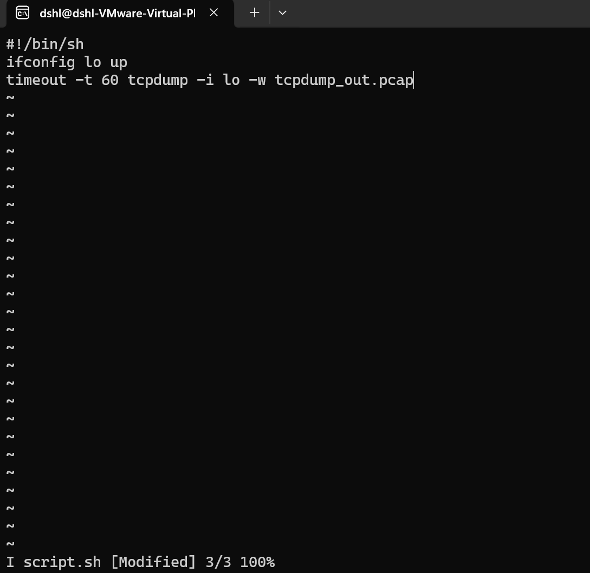

# Лабораторна робота 7. Додати модуль tcpdump в прошивку ядра операційної системи tcpdump. Відповідні скриншоти додати в протокол з стартовою прошивкою.

1. Build libcap
   
2. Build tcpdump
   
   
3. Flash and run QEMU with tcpdump
   
4. Create script.sh
   
5. Configure network interface
   
6. Run the script
   
7. Check tcpdump_out.pcap
   